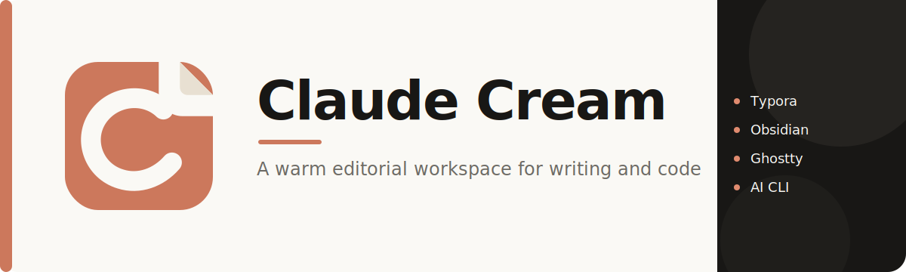
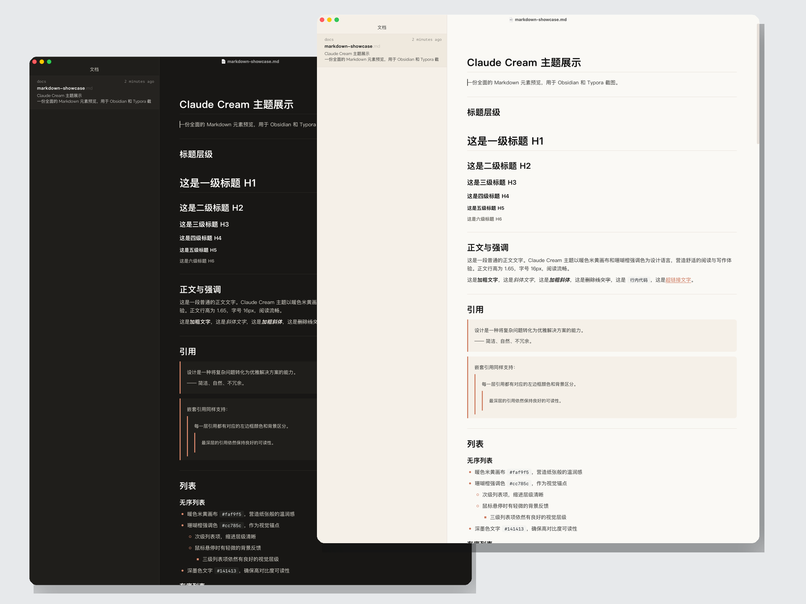
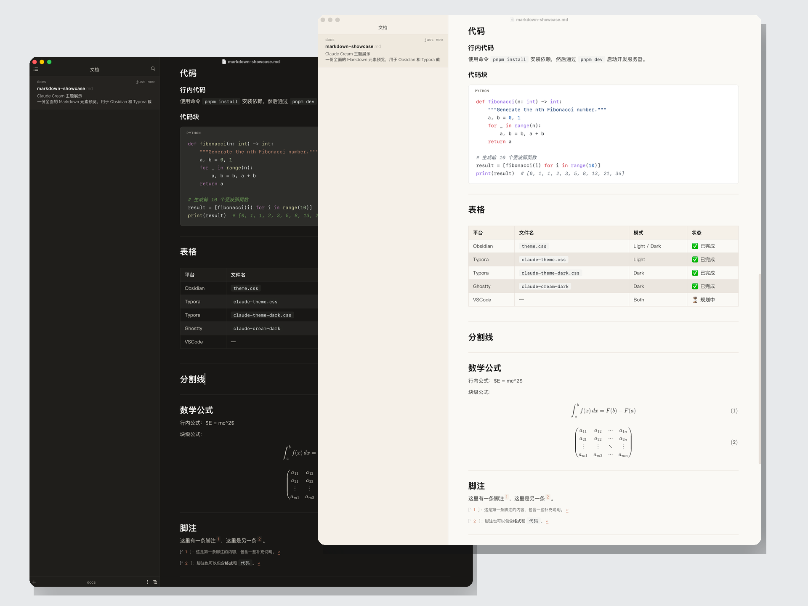
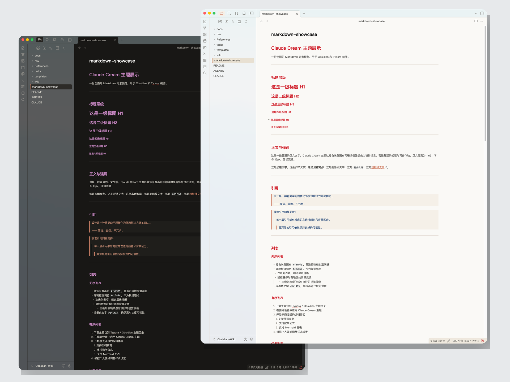
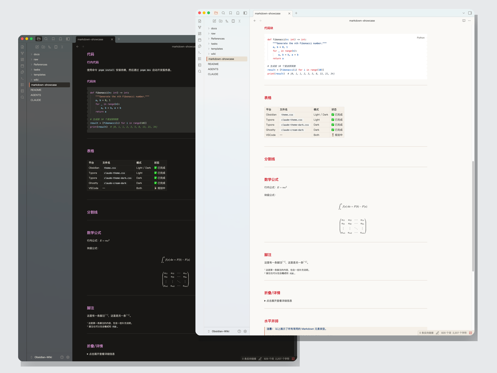

<p align="center">
  
</p>

<h1 align="center">Claude Cream</h1>

<p align="center">
  
</p>

> Palette: cream + coral · Mode: light + dark · Font: PingFang SC + JetBrainsMono Nerd Font Mono · License: [MIT](./LICENSE)

[](https://github.com/kakarrot0109/claude-cream)
[](https://github.com/kakarrot0109/claude-cream)
[](https://github.com/kakarrot0109/claude-cream)
[](https://github.com/kakarrot0109/claude-cream)
[](./LICENSE)

[中文版](README.zh-CN.md)

A warm editorial workspace — design system & themes for Typora, Obsidian, Ghostty, and AI CLIs.

Inspired by the [Claude.com](https://claude.com) visual language: warm canvas, restrained coral, and a typographic sensibility that makes code feel editorial rather than industrial.

---

## Highlights

- **Warm cream canvas** `#faf9f5` — not cold white, feels like paper
- **Coral accent** `#cc785c` — the signature hue, human without being loud
- **Ink-dark code surface** `#181715` — high contrast with room to breathe
- **Chinese-first typography** — PingFang SC system font for prose, JetBrains Mono for code
- **One design language, four platforms** — Typora, Obsidian, Ghostty themes + CLI configs, all aligned

## Gallery

### Typora — Light



### Typora — Dark



### Obsidian — Light



### Obsidian — Dark



## What's Inside

```
claude-cream/
├── themes/
│   ├── typora/              # Theme (Light + Dark)
│   ├── obsidian/            # Theme (Light + Dark one-file + Style Settings)
│   └── ghostty/             # Terminal themes (Light + Dark) + config
├── clients/
│   ├── claude-code/         # Project-level CLAUDE.md
│   ├── codex/               # AGENTS.md for Codex CLI
│   └── cursor/              # Cursor settings.json
├── tokens/                  # Shared design tokens, single source of truth
└── tasks/                   # Project tracking
```

### Design Tokens

`tokens/tokens.json` is the single source of truth.

| Group | Description |
|---|---|
| `colors.light` / `colors.dark` | 25 semantic color variables per mode |
| `typography` | Font stacks, sizes, line heights |
| `spacing` / `rounded` | 8 spacing steps + 6 border-radius steps |
| `syntax.light` / `syntax.dark` | Syntax highlighting tokens (keywords, strings, comments, etc.) |

Change a token here, and all platform themes should follow (Typora / Obsidian via manual mapping, Ghostty via palette).

## Install

### Typora

```bash
# macOS
cp themes/typora/*.css themes/typora/.claude-theme-base.css \
  "$HOME/Library/Application Support/abnerworks.Typora/themes/"
osascript -e 'quit app "Typora"' && sleep 1 && open -a Typora
```

Windows: `%APPDATA%\Typora\themes\` &middot; Linux: `~/.config/Typora/themes/`

> Theme file names must use **hyphens** — Typora rejects underscores.

### Obsidian

```bash
cp -R themes/obsidian "$HOME/Dev/obsidian-wiki/.obsidian/themes/Claude Cream"
```

Then: Settings &rarr; Appearance &rarr; Themes &rarr; Claude Cream. Dark mode follows Obsidian's native toggle.

Works with the [Style Settings](obsidian://show-plugin?id=obsidian-style-settings) plugin for extra customization.

### Ghostty

```bash
mkdir -p "$HOME/.config/ghostty/themes"
cp themes/ghostty/config.ghostty "$HOME/.config/ghostty/config"
cp themes/ghostty/claude-cream-light themes/ghostty/claude-cream-dark \
  "$HOME/.config/ghostty/themes/"
```

Restart Ghostty. Auto-switches with system appearance.

### AI CLIs

| CLI | Config to copy |
|---|---|
| Claude Code | `clients/claude-code/CLAUDE.md` &rarr; project root or `~/.claude/CLAUDE.md` |
| Codex CLI | `clients/codex/AGENTS.md` &rarr; project root |
| Cursor | `clients/cursor/settings.json` &rarr; merge into Cursor user settings |

## Design Principles

1. **Warm over cool** &mdash; deliberate warmth; no sterile gray or cold white
2. **Serif restraint** &mdash; PingFang SC carries enough character; avoids serif font fallback issues on Windows/Linux
3. **Local-first** &mdash; all assets work offline; no paid fonts, no cloud dependencies
4. **Single source of truth** &mdash; `tokens/tokens.json` drives every platform
5. **Minimal customization** &mdash; expose only what matters: page width, font size, accent color

## Requirements

| Platform | Minimum | Notes |
|---|---|---|
| Typora | 1.5+ | Windows / macOS / Linux |
| Obsidian | 1.4.0+ | All platforms |
| Ghostty | 1.0+ | macOS / Linux |
| macOS | 12+ | PingFang SC system font |

**Fonts**:
- Prose: PingFang SC (built into macOS; system fallback on Windows/Linux)
- Code: JetBrainsMono Nerd Font Mono (install locally; [Nerd Fonts](https://www.nerdfonts.com/font-downloads) recommended)

## Contributing

This is a personal config project, so PRs are reviewed selectively. Issues and design discussions are welcome.

## License

MIT &mdash; see [LICENSE](./LICENSE).

## Credits

- Visual system inspired by [Anthropic Claude](https://claude.com)
- Reference themes: [YiNNx/typora-theme-lapis](https://github.com/YiNNx/typora-theme-lapis) &middot; [kepano/obsidian-minimal](https://github.com/kepano/obsidian-minimal)
- Font: [JetBrains Mono](https://www.jetbrains.com/mono/) (OFL 1.1)

---

Made with &#x2615; + coral by [KAKARROT](https://github.com/kakarrot0109)
