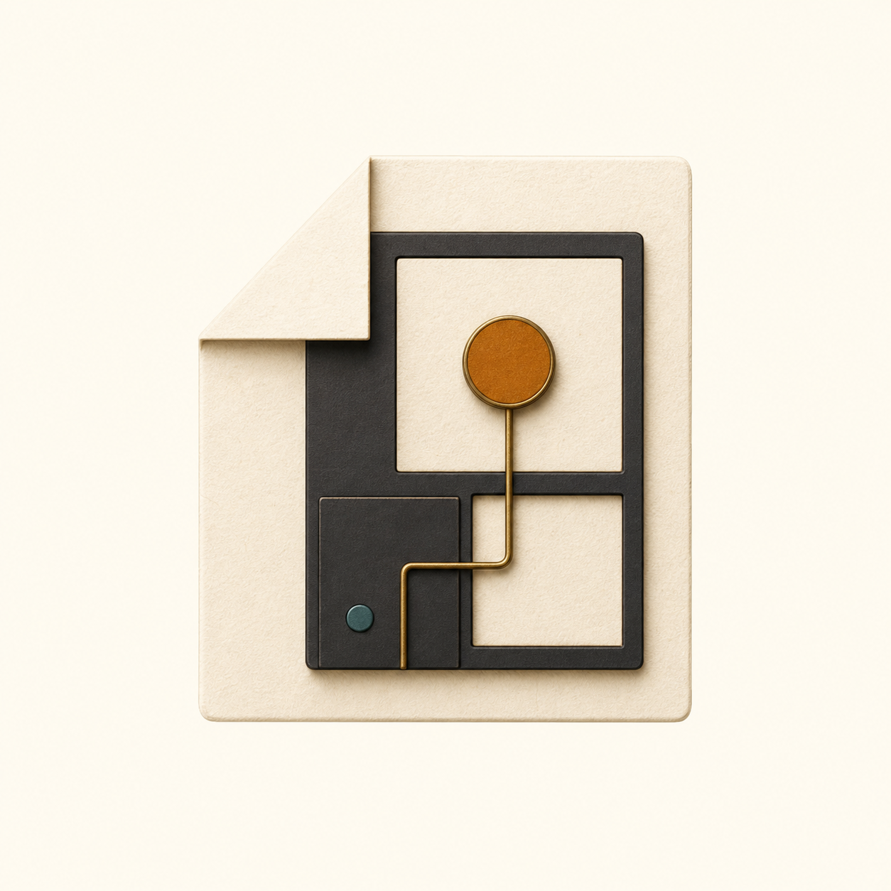

<p align="center">
  
</p>

<h1 align="center">Claude Cream</h1>

<p align="center">
  
</p>

[](https://github.com/kakarrot-dev/claude-cream)
[](https://github.com/kakarrot-dev/claude-cream)
[](https://github.com/kakarrot-dev/claude-cream)
[](./LICENSE)

暖色调主题资产库，覆盖 Typora、Obsidian、Ghostty、Website 与可复用插画生成规范。

设计灵感来自 [Claude.com](https://claude.com) 的视觉语言：有层次的暖色表面、克制的琥珀金，以及让代码看起来像印刷物而非工业面板的排版质感。

---

## 特点

- **暖象牙画布** `#f5f3e9` &mdash; 避免冷白，并通过表面层次保持温润
- **琥珀金强调** `#b7791f` &mdash; 克制、温暖，同时清晰表达交互状态
- **暖炭灰深色画布** `#2d2e2d` &mdash; 保持深度而不使用生硬纯黑
- **中文优先排版** &mdash; 正文用 PingFang SC 系统字体，代码用 JetBrains Mono
- **一套视觉语言，五类主题资产** &mdash; Typora、Obsidian、Ghostty、Website 与 Illustration

## 目录结构

```
claude-cream/
├── themes/
│   ├── typora/              # Markdown 写作 Light + Dark 主题
│   ├── obsidian/            # 知识库双模式主题
│   ├── ghostty/             # 终端调色板与 Ghostty 配置
│   ├── website/             # Website 色彩主题（Light + Dark）
│   └── illustration/        # 图像生成风格与提示词模板
├── img/brand/               # 项目 Logo 与横幅
├── tokens/                  # 跨平台共享设计 token（单一真源）
└── tasks/                   # 项目跟踪
```

### 设计 Token

`tokens/tokens.json` 是 Typora、Obsidian 与 Ghostty 三类主题的唯一真源。

| 分组 | 说明 |
|---|---|
| `colors.light` / `colors.dark` | 每种模式 26 个语义色变量 |
| `typography` | 字体栈 + 字号 + 行高 |
| `spacing` / `rounded` | 间距 8 档 + 圆角 6 档 |
| `syntax.light` / `syntax.dark` | 代码高亮语义色（关键字 / 字符串 / 注释等）|

`tokens/tokens.json` 通过手工映射驱动 Typora、Obsidian 与 Ghostty。`themes/website` 独立保存博客色板快照，`themes/illustration` 将 Website 视觉语言转化为可复用的图像生成规则。

## 安装

### Typora

```bash
# macOS
cp themes/typora/claude-theme.css themes/typora/claude-theme-dark.css \
  "$HOME/Library/Application Support/abnerworks.Typora/themes/"
osascript -e 'quit app "Typora"' && sleep 1 && open -a Typora
```

Windows：`%APPDATA%\Typora\themes\` &middot; Linux：`~/.config/Typora/themes/`

> 主题文件名必须用**连字符**，否则 Typora 无法加载。

### Obsidian

```bash
cp -R themes/obsidian "$HOME/Dev/obsidian-wiki/.obsidian/themes/Claude Cream"
```

进入 Obsidian &rarr; 设置 &rarr; 外观 &rarr; 主题 &rarr; 选择 Claude Cream。深色模式跟随 Obsidian 原生切换联动。

配合 [Style Settings](obsidian://show-plugin?id=obsidian-style-settings) 插件可额外自定义。

### Ghostty

```bash
mkdir -p "$HOME/.config/ghostty/themes"
cp themes/ghostty/config.ghostty "$HOME/.config/ghostty/config"
cp themes/ghostty/claude-cream-light themes/ghostty/claude-cream-dark \
  "$HOME/.config/ghostty/themes/"
```

重启 Ghostty，自动跟随系统外观切换。

### Website

在网站样式入口引入独立色彩主题：

```css
@import "./themes/website/theme.css";
```

使用 `html[data-theme="light"]` 与 `html[data-theme="dark"]` 切换模式。适用范围和来源见 [`themes/website/README.md`](themes/website/README.md)。

### Illustration

组合使用 [`themes/illustration/prompt-template.md`](themes/illustration/prompt-template.md) 与 [`themes/illustration/style.json`](themes/illustration/style.json)，生成与 Website 一致的封面和编辑插画。

每个主题目录均提供独立 README，说明安装、映射关系与验证方式。

## 设计原则

1. **暖色优先** &mdash; 刻意选择暖色调，不做冷灰白
2. **克制衬线** &mdash; PingFang SC 足以撑起编辑气质，避免 Windows/Linux 崩坏
3. **本地优先** &mdash; 所有配置离线可用，不依赖付费字体或云服务
4. **真源边界清晰** &mdash; 编辑器与终端共享 Token 位于 `tokens/`，Website 与 Illustration 各自记录来源
5. **精简自定义** &mdash; 只暴露真正常用的选项：页宽、字号、主色

## 环境要求

| 平台 | 最低版本 | 备注 |
|---|---|---|
| Typora | 1.5+ | Windows / macOS / Linux |
| Obsidian | 1.4.0+ | 全平台 |
| Ghostty | 1.0+ | macOS / Linux |
| Website 主题 | 现代浏览器 | 需要支持 `color-mix()` |
| macOS | 12+ | PingFang SC 系统字体 |

**字体**：
- 正文：PingFang SC（macOS 系统自带；Windows/Linux 使用系统 fallback）
- 代码：JetBrains Mono（Typora 已内嵌；Ghostty/Obsidian 需系统安装，推荐 [JetBrainsMono Nerd Font](https://www.nerdfonts.com/font-downloads)）

## 贡献

个人配置项目，PR 谨慎接受。欢迎 Issue 讨论设计选择、报告 Bug、提出新平台适配建议。

## 许可证

MIT &mdash; 详见 [LICENSE](./LICENSE)。

## 致谢

- 视觉系统灵感来自 [Anthropic Claude](https://claude.com)
- 参考主题：[amm10090/claude-warm-obsidian-theme](https://github.com/amm10090/claude-warm-obsidian-theme) &middot; [YiNNx/typora-theme-lapis](https://github.com/YiNNx/typora-theme-lapis) &middot; [kepano/obsidian-minimal](https://github.com/kepano/obsidian-minimal)
- 字体：[JetBrains Mono](https://www.jetbrains.com/mono/)（OFL 1.1）
- 品牌视觉：依据本仓 Claude Cream 色板与插画规范生成

---

用 &#x2615; + 琥珀金制作 by [KAKARROT](https://github.com/kakarrot-dev)
